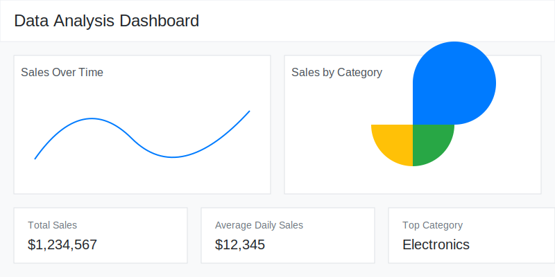

# Data Analysis Dashboard

A modern, interactive data visualization dashboard built with Python Flask and Plotly. This dashboard allows users to analyze sales data through interactive charts, filters, and summary statistics.



## Features

- 📊 Interactive data visualizations using Plotly
- 📅 Real-time data filtering by date and category
- 📁 CSV file upload functionality
- 📈 Summary statistics display
- 📱 Responsive design using Bootstrap
- 🔄 Real-time updates

## Tech Stack

- Backend: Python Flask
- Frontend: HTML, CSS, JavaScript
- Data Processing: Pandas
- Visualization: Plotly
- Styling: Bootstrap 5
- Package Management: pip

## Prerequisites

- Python 3.8 or higher
- pip (Python package manager)
- Web browser (Chrome, Firefox, or Safari recommended)

## Installation Guide

1. **Clone the Repository**
   ```bash
   git clone <repository-url>
   cd data-dashboard
   ```

2. **Create a Virtual Environment** (Optional but recommended)
   ```bash
   # Windows
   python -m venv venv
   venv\Scripts\activate

   # Linux/MacOS
   python3 -m venv venv
   source venv/bin/activate
   ```

3. **Install Dependencies**
   ```bash
   pip install -r requirements.txt
   ```

4. **Run the Application**
   ```bash
   python app.py
   ```

5. **Access the Dashboard**
   Open your web browser and navigate to:
   ```
   http://localhost:5000
   ```

## Project Structure

```
data-dashboard/
├── app.py                 # Main Flask application
├── requirements.txt       # Python dependencies
├── static/
│   ├── css/
│   │   └── style.css     # Custom styles
│   ├── js/
│   │   └── main.js       # Frontend JavaScript
│   └── img/              # Image assets
└── templates/
    └── index.html        # Main dashboard template
```

## Step-by-Step Tutorial

### 1. Setting Up the Project

1. Create the project directory structure as shown above
2. Create and activate a virtual environment
3. Install required packages:
   ```bash
   pip install flask pandas plotly python-dotenv gunicorn
   ```
4. Create `requirements.txt`:
   ```bash
   pip freeze > requirements.txt
   ```

### 2. Creating the Flask Application (app.py)

1. Import required libraries
2. Set up Flask application
3. Create sample data generator
4. Implement routes:
   - Main dashboard route ('/')
   - Data API route ('/api/data')
   - File upload route ('/upload')

### 3. Building the Frontend

1. **Create HTML Template (index.html)**
   - Set up Bootstrap layout
   - Add filter controls
   - Create chart containers
   - Add summary statistics cards
   - Include necessary scripts

2. **Add Custom Styling (style.css)**
   - Style chart containers
   - Create responsive layouts
   - Style cards and controls
   - Add hover effects

3. **Implement JavaScript (main.js)**
   - Create dashboard update function
   - Implement file upload handling
   - Add chart initialization
   - Handle real-time updates

### 4. Implementing Data Processing

1. **Data Loading**
   - Create sample data generator
   - Implement CSV file upload
   - Add data validation

2. **Data Filtering**
   - Add date range filtering
   - Implement category filtering
   - Create summary statistics

3. **Visualization**
   - Create line chart for sales over time
   - Implement pie chart for category distribution
   - Add interactive features

## Using the Dashboard

1. **Viewing Data**
   - Launch the application
   - View default sample data visualization
   - Interact with charts

2. **Filtering Data**
   - Use date range picker
   - Select specific categories
   - View updated visualizations

3. **Uploading Custom Data**
   - Prepare CSV file with columns: date, sales, category
   - Use upload button
   - View updated dashboard

## CSV File Format

Your CSV file should have the following columns:
```csv
date,sales,category
2023-01-01,100,Electronics
2023-01-02,150,Clothing
...
```

## Customization

1. **Changing Chart Colors**
   - Modify Plotly configuration in app.py
   - Update chart themes in main.js

2. **Adding New Features**
   - Extend Flask routes in app.py
   - Add new visualization components
   - Implement additional filters

## Troubleshooting

Common issues and solutions:

1. **No Data Showing**
   - Check CSV file format
   - Verify date format (YYYY-MM-DD)
   - Check browser console for errors

2. **Chart Layout Issues**
   - Adjust container sizes in style.css
   - Update chart margins in main.js
   - Check responsive breakpoints

## Contributing

1. Fork the repository
2. Create a feature branch
3. Commit your changes
4. Push to the branch
5. Create a Pull Request

## License

This project is licensed under the MIT License - see the LICENSE file for details.

## Acknowledgments

- Flask documentation
- Plotly documentation
- Bootstrap team
- Open source community

---

For more information or support, please open an issue in the repository.
