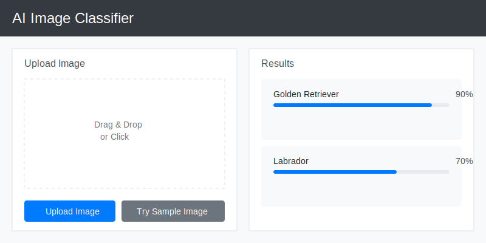

# AI Image Classifier

An interactive web application that analyzes images using computer vision techniques. Upload any image and get instant analysis of its visual characteristics including brightness, contrast, color dominance, and pattern complexity.



## Features

- **Image Upload**: Drag & drop or file selection support for JPG, JPEG, PNG, GIF (up to 16MB)
- **Real-time Analysis**: Instant analysis of uploaded images
- **Multiple Characteristics**: Analyzes:
  - Brightness levels
  - Contrast levels
  - Color dominance
  - Pattern complexity
  - Color vibrancy
- **Image Comparison**: Side-by-side comparison with previously uploaded image
- **Detailed Results**: Confidence scores for each characteristic
- **Responsive Design**: Works on both desktop and mobile devices

## Technologies Used

- **Backend**:
  - Python
  - Flask
  - OpenCV (cv2)
  - NumPy
  - Pillow (PIL)
  
- **Frontend**:
  - HTML5
  - CSS3
  - JavaScript
  - Bootstrap

## Installation

1. Clone the repository:
   ```bash
   git clone https://github.com/widyobumi/widyobumi.github.io.git
   cd widyobumi.github.io/projects/image-classifier
   ```

2. Install dependencies:
   ```bash
   pip install -r requirements.txt
   ```

3. Run the application:
   ```bash
   python app.py
   ```

4. Open your browser and navigate to:
   ```
   http://localhost:5000
   ```

## Usage

1. Open the application in your web browser
2. Upload an image using drag & drop or the file selector
3. View the analysis results showing various image characteristics
4. Upload another image to see a side-by-side comparison

## Project Structure

```
image-classifier/
├── app.py              # Main Flask application
├── requirements.txt    # Python dependencies
├── static/
│   ├── css/           # Stylesheets
│   ├── js/            # JavaScript files
│   ├── uploads/       # Uploaded images
│   └── img/           # Static images
└── templates/         # HTML templates
```

## Contributing

Feel free to open issues or submit pull requests if you have suggestions for improvements!
